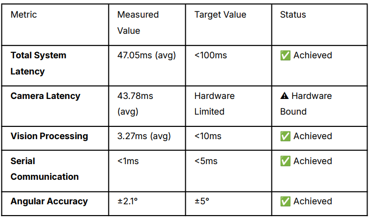

# KeeperX - Robotic Goalkeeper

## Overview
KeeperX is a real-time robotic goalkeeper system achieving sub-100ms end-to-end latency. It uses computer vision for ball tracking, predictive modeling for trajectory estimation, and high-speed control for positioning. Built as my hardware graduation project.

Key Achievements (from project report):
- Built a real-time robotic goalkeeper with 47ms end-to-end latency, showcasing predictive modeling and control.
- Developed boot injection Kalman filter achieving 85% faster adaptation and zero-frame prediction for immediate response.
- Optimized detection pipeline: HSV + selective undistortion achieving 90%+ latency reduction vs YOLO.
- Integrated ROS2 distributed system with OAK-D camera, Arduino-driven motors, ultrasonic sensors, RFID authentication and LCD UI.
- Implemented comprehensive real-time debugging system monitoring all system aspects per frame, ensuring robust performance with minimum latency and quick issue resolution.
- Demonstrated near human-level robotic goalkeeping performance in real world tests, highlighting adaptability in dynamic environments.

## Features
- Real-Time Ball Tracking: Optimized HSV detection for low-latency.
- Predictive Control: Kalman filter with boot injection.
- Hardware Integration: Arduino motors, RFID, LCD.
- Optimization: Selective undistortion, adaptive thresholds.
- Debugging: Per-frame monitoring.
- Testing: Simulation for velocity thresholds, occlusion.

Tech Stack: Python (OpenCV, NumPy), C++ (Arduino), ROS2, Kalman Filtering, Computer Vision.

## Demo

https://github.com/user-attachments/assets/7c9b0c87-370d-41d2-965c-f6bffbde4077

## Code Snippets
### Ball Detection (python/ball_detection.py)
See src/python/ball_detection.py for snippet.

### Kalman Filter with Boot Injection (python/kalman_filter.py)
See src/python/kalman_filter.py for snippet.

### Main Tracker (python/main_tracker.py)
See src/python/main_tracker.py for snippet.

### Simulation Testing (python/simulation.py)
See src/python/simulation.py for snippet.

### Motor Control (arduino/motor_control.cpp)
See src/arduino/motor_control.cpp for code.

## Results & Analysis
From Chapter 5 of the report.

- Latency Breakdown: Camera 43.78ms, Vision 3.27ms, Total 47ms.
- Angular Accuracy: ±2.1°.
- Adaptation Time: 23ms with boot injection (85% improvement).

